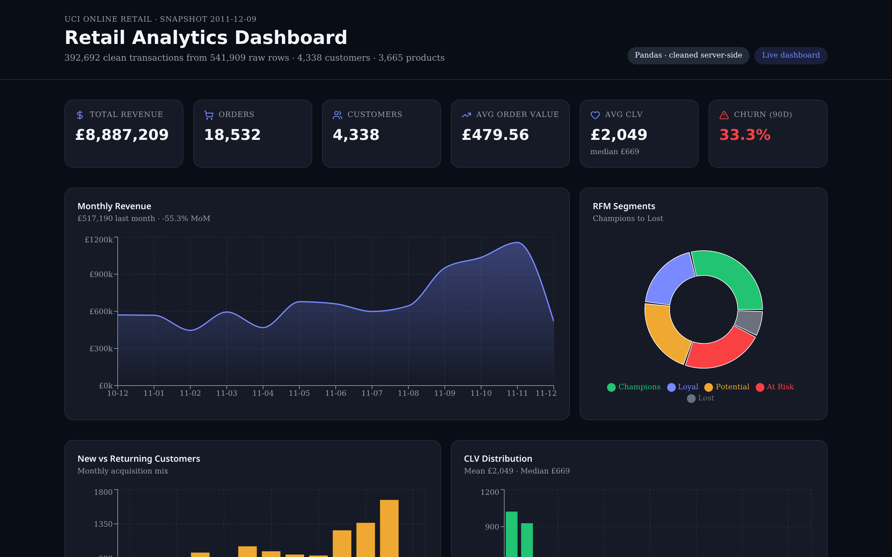
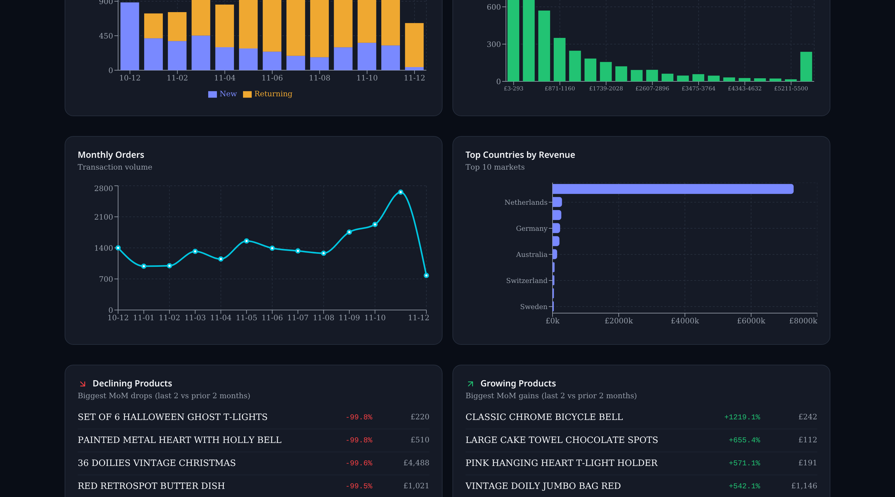
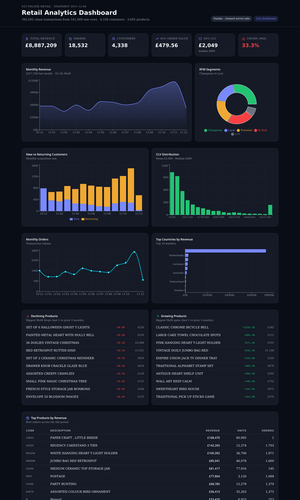

# Retail Analytics Dashboard

End-to-end analytics project on the **UCI Online Retail** dataset (541,909 UK e-commerce transactions). A Python/Pandas pipeline cleans the raw data and computes CLV, MRR, RFM segmentation, and product churn, then a React dashboard renders the results.



## Highlights

- **541,909 → 392,692** rows after cleaning (nulls, cancellations, negatives, duplicates removed)
- **£8.9M** total revenue across **4,338** unique customers
- **£2,049** average customer lifetime value (CLV)
- **33.4%** 90-day churn rate
- Full **RFM segmentation** (Champions → Lost) and product-level growth/decline detection

## Tech Stack

**Data pipeline**
- Python 3 · Pandas · NumPy · openpyxl · requests
- Cleans the UCI Online Retail dataset and exports `public/data/analytics.json`
- Also produces a cleaned CSV and a standalone HTML report

**Dashboard**
- React 19 + TypeScript
- TanStack Start (SSR) + TanStack Router + TanStack Query
- Recharts for visualizations
- Tailwind CSS v4 with a custom OKLCH dark theme
- Lucide icons

## Key KPIs Computed

| Metric | Description |
| --- | --- |
| Total Revenue / Orders / Customers | Portfolio-level scale |
| Average Order Value (AOV) | Revenue ÷ orders |
| Customer Lifetime Value (CLV) | Mean & median lifetime spend per customer |
| Monthly Recurring Revenue (MRR) | Monthly revenue trend + MoM delta |
| New vs Returning | Monthly acquisition mix |
| 90-day Churn Rate | Customers inactive for 90+ days |
| RFM Segments | Recency / Frequency / Monetary buckets |
| Product Churn | Top declining & growing SKUs (MoM) |
| Top Countries | Revenue-weighted market ranking |

## Project Structure

```text
├── analysis/
│   ├── generate_analytics.py    # Python/Pandas data pipeline
│   ├── requirements.txt         # Python dependencies
│   └── .cache/                  # generated artifacts (gitignored)
│       ├── raw_online_retail.xlsx # downloaded dataset
│       ├── online_retail_clean.csv
│       └── report.html
├── public/
│   └── data/
│       └── analytics.json       # cleaned KPIs consumed by the UI
├── src/
│   ├── routes/index.tsx         # dashboard route (Recharts)
│   ├── routes/__root.tsx        # app shell + SEO metadata
│   └── styles.css               # Tailwind v4 theme tokens
└── docs/screenshots/            # README images
```

## Prerequisites

- **Node.js** 18+ and **Bun** (or npm/yarn/pnpm)
- **Python** 3.10+ with `pip`

> The dashboard itself does not require any backend service or cloud account. It reads the pre-generated `public/data/analytics.json` file at runtime.

## Environment Variables

This project **does not require any environment variables** to run locally. All data is self-contained in `public/data/analytics.json`.

If you later add a backend service (e.g., Supabase, an API key), create a `.env` file in the project root and add it there. The frontend can read public variables prefixed with `VITE_` from `import.meta.env`.

## Setup & Run

### 1. Generate the dashboard data

The Python pipeline downloads the UCI Online Retail dataset, cleans it, computes KPIs, and writes the JSON the dashboard consumes.

```bash
# Create a virtual environment (recommended)
python -m venv .venv
source .venv/bin/activate        # On Windows: .venv\Scripts\activate

# Install Python dependencies
python -m pip install -r analysis/requirements.txt

# Run the analysis pipeline
python analysis/generate_analytics.py
```

After this step, you will have:

- `public/data/analytics.json` — dashboard data source (committed)
- `analysis/.cache/online_retail_clean.csv` — cleaned transactions (gitignored)
- `analysis/.cache/report.html` — standalone static report (gitignored)
- `analysis/.cache/raw_online_retail.xlsx` — downloaded raw dataset (gitignored)

The `.cache` folder is intentionally gitignored because the raw dataset and CSV are large files. The dashboard only needs the checked-in `public/data/analytics.json`.

### 2. Install frontend dependencies

```bash
bun install
```

If you prefer npm:

```bash
npm install
```

### 3. Start the development server

```bash
bun run dev
```

Then open [http://localhost:8080](http://localhost:8080).

The dev server hot-reloads, so changes to `src/` or `public/data/analytics.json` are reflected immediately.

### 4. Build for production

```bash
bun run build
```

To preview the production build locally:

```bash
bun run preview
```

## Updating the Data

Whenever you want to re-run the analysis (e.g., after changing the pipeline), just repeat step 1:

```bash
source .venv/bin/activate
python analysis/generate_analytics.py
```

The dashboard will automatically pick up the new `public/data/analytics.json`.

## Screenshots

**KPIs, MRR trend, and RFM segmentation**


**New vs returning customers and CLV distribution**



**Full dashboard**



## Dataset

[UCI Machine Learning Repository — Online Retail](https://archive.ics.uci.edu/dataset/352/online+retail): transactions from a UK-based online retailer between 01/12/2010 and 09/12/2011.

